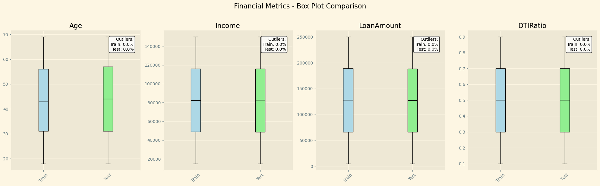
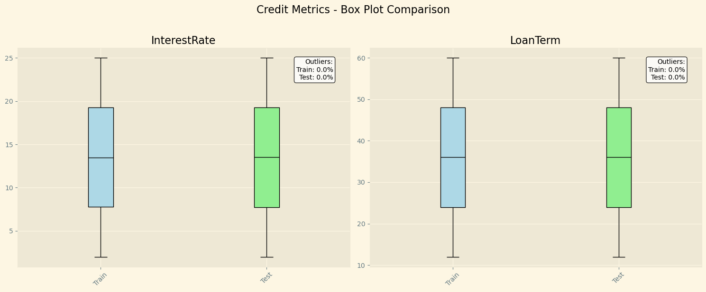
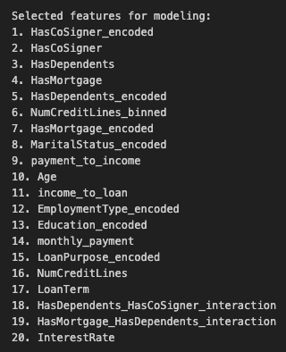
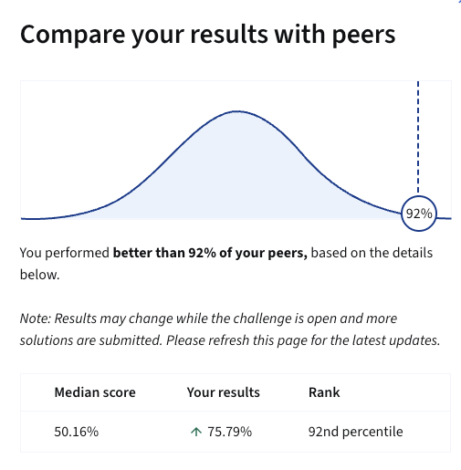

# 🏆 Loan Default Prediction – Coursera Data Science Challenge  

This project was submitted to the **Coursera Data Science Challenge**, where I ranked **Top 92 globally** 🥳.  

The task was to build a predictive model to assess the probability of a borrower defaulting on a loan—a high-impact problem in credit risk management.  

---

## 📌 Project Overview
The challenge required end-to-end development of a classification model, from data cleaning and feature engineering to model evaluation. I approached it as if solving a real-world financial risk problem:

- Carefully explored and cleaned the dataset to ensure reliability.  
- Grouped predictors into financial metrics, credit metrics, and other borrower characteristics for structured analysis.  
- Paid close attention to distributions, box plots, and feature weight tables to identify high-impact variables.  
- Designed the model to handle not only ordinary loan cases, but also extreme borrower scenarios (common in credit risk).  

---

## 📊 Key Visuals  

### Feature Distributions
  
*Box plots showing financial metric distributions for borrowers.*  

  
*Box plots showing credit metric distributions for borrowers.*  

### Feature Importance
  
*Most influential features driving loan default predictions.*  

---

## 🔎 Methodology
1. **Problem Understanding** → Binary classification (default = 1, non-default = 0).  
2. **Data Cleaning & Exploration** → Outlier handling, missing values, scaling.  
3. **Feature Engineering** → Grouped features into financial, credit, other borrower metrics.  
4. **Visualization** → Box plots, correlation analysis, feature importance tables.  
5. **Model Building & Evaluation** → Logistic Regression, Decision Trees, Random Forest, XGBoost.  
6. **Metrics** → ROC-AUC, Precision, Recall, F1-Score.  

---

## 🚀 Results & Achievements
- **Top 92 globally** in Coursera Data Science Challenge.
    
- Strong predictive performance on both ordinary and extreme borrower profiles.  
- Financial and credit metrics emerged as the most influential predictors.  
- Pipeline designed for **interpretability + rob**

